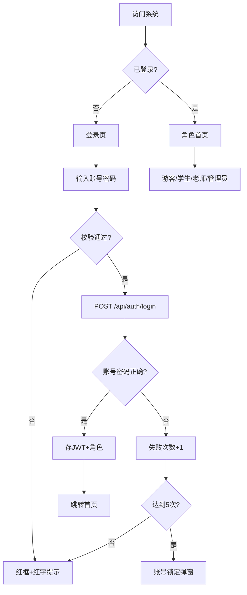

# 高校学科竞赛报名管理系统 - 产品需求文档（PRD）

## 1. 产品概述

**高校学科竞赛报名管理系统** 是一套面向高校的竞赛全生命周期管理平台，支持游客、学生、老师、管理员四类角色的权限分离，提供竞赛发布、个人/团队报名、审核、数据统计、首页运营等完整能力。

- **核心目标**：打通"竞赛发布 → 浏览报名 → 审核管理 → 数据统计"全链路
- **目标用户**：高校在校学生、指导老师、院系管理员、系统管理员
- **产品价值**：替代传统 Excel/微信群报名方式，提升组织效率与数据可视化能力

---

## 2. 核心功能

### 2.1 角色与权限

| 角色 | 注册方式 | 核心权限 |
|------|---------|---------|
| 游客 | 无需注册 | 浏览首页、竞赛列表、竞赛详情；不可报名、不可创建团队、不可进入后台 |
| 学生 | 学号/邮箱注册 | 个人赛报名、创建/加入团队、提交团队报名、管理个人资料 |
| 老师 | 管理员后台添加 | 审核所指导竞赛的个人/团队报名、查看报名统计、浏览竞赛 |
| 管理员 | 系统预置 | 竞赛发布与上下架、轮播图与热门推荐管理、用户管理、统计大屏 |

### 2.2 功能模块

#### 前台（游客/学生）
1. **首页**：轮播图、热门推荐、分类入口、近期竞赛
2. **竞赛列表**：分页、关键词搜索、分类筛选、状态筛选（报名中/已截止）
3. **竞赛详情**：封面、简介、奖项设置、赛程时间、报名按钮、相关推荐
4. **个人中心**：资料管理、我的报名、我的团队、消息通知
5. **团队管理**：创建团队、邀请成员、审核申请、提交报名
6. **登录/注册/找回密码**：账号密码登录、6 位邀请码加入团队

#### 后台 - 管理员
1. **竞赛管理**：CRUD、上下架、批量导入、统计
2. **报名管理**：查看所有报名、审核（通过/拒绝）、导出
3. **内容维护**：轮播图 CRUD、热门推荐 CRUD
4. **数据统计**：报名趋势、分类分布、院系参与度
5. **用户管理**：学生/老师账号维护

#### 后台 - 老师
1. **我的竞赛**：查看所指导的竞赛
2. **报名审核**：个人/团队报名审核
3. **统计查看**：所指导竞赛的报名数据

### 2.3 页面清单

| 页面 | 模块 | 功能说明 |
|------|------|---------|
| 登录页 | 登录卡片 | 账号密码登录、错误提示、5 次失败锁定 15 分钟、立即注册、忘记密码入口 |
| 注册页 | 注册卡片 | 学号/姓名/学院/手机号/邮箱/密码注册 |
| 首页 | 轮播图区 | 自动轮播 5 张、指示器、点击跳转 |
| 首页 | 热门推荐 | 横向滚动卡片 6 张 |
| 首页 | 近期竞赛 | 卡片网格，按时间倒序 |
| 竞赛列表 | 搜索筛选栏 | 关键词 + 分类 + 状态 |
| 竞赛列表 | 卡片网格 | 封面、标题、状态标签、人数、主办方 |
| 竞赛详情 | 头部封面 | 大图 + 标题 + 状态 |
| 竞赛详情 | Tab 内容 | 简介/赛程/奖项/报名须知 |
| 竞赛详情 | 报名区 | 个人赛一键报名 / 团队赛创建/加入 |
| 个人中心 | 资料卡片 | 头像、姓名、学号、学院 |
| 个人中心 | 报名记录 | 表格 + 状态标签 |
| 个人中心 | 我的团队 | 卡片列表 + 状态 |
| 团队管理 | 成员列表 | 队长、成员、操作 |
| 团队管理 | 邀请 | 6 位邀请码 + 复制 |
| 管理员-竞赛管理 | 表格 | 标题、分类、状态、操作 |
| 管理员-报名管理 | 表格 | 用户、竞赛、状态、审核 |
| 管理员-内容维护 | 轮播图/热门推荐 | 列表 + 编辑表单 |
| 管理员-统计 | 卡片 + 图表 | ECharts 趋势/饼图/柱状图 |
| 老师-审核 | 待审核列表 | 报名信息 + 通过/拒绝按钮 |
| 老师-统计 | 卡片 | 所指导竞赛统计 |

---

## 3. 核心流程

### 3.1 学生个人赛报名流程
登录 → 浏览竞赛 → 点击详情 → 报名按钮 → 确认弹窗 → 提交 → 后端记录 → 异步通知 → 状态为"待审核" → 老师审核 → 状态更新

### 3.2 团队赛流程
**创建团队**：登录 → 团队赛详情 → 创建团队 → 填写队名/口号 → 生成 6 位邀请码 → 邀请成员 → 成员加入 → 队长审核 → 满员 → 提交报名
**加入团队**：登录 → 输入邀请码 → 申请加入 → 队长审核 → 成为成员

### 3.3 登录与异常流程
输入账号密码 → 校验格式 → 调后端 `/api/auth/login` → 成功：存 JWT 到 localStorage，跳转角色对应首页 → 失败：累计次数，5 次触发账号锁定弹窗（15 分钟）

---

## 4. 用户界面设计

### 4.1 设计风格

- **主色**：科技蓝 `#2B6CB0`（主按钮、Logo、链接）
- **辅色**：浅蓝 `#EBF4FB`（输入框背景、辅助区块）
- **警示色**：橙色 `#F6AD55`（待审核、锁定图标）、绿色 `#48BB78`（已通过）、红色 `#E53E3E`（已拒绝、错误）
- **背景**：白底卡片 + 浅灰页面 `#F5F7FA`，圆角 8px
- **按钮**：
  - 主按钮 = 蓝色实心 + 白色文字 + 圆角 6px
  - 次按钮 = 灰色描边 + 深灰文字
  - 禁用按钮 = 浅灰背景 + 灰色文字 + 不可点击
- **字体**：标题思源黑体 / 苹方，正文 PingFang SC / Microsoft YaHei
- **图标**：Element Plus Icons + 自定义彩色方块 Logo
- **布局**：卡片化（卡片白底 + 阴影 + 圆角）

### 4.2 关键页面设计概述

| 页面 | 模块 | UI 元素 |
|------|------|---------|
| 登录页 | 登录卡片 | 居中 600×480、白色背景、圆角 8px、阴影、蓝色 Logo 方块、标题"高校学科竞赛报名管理系统"、副标题"欢迎回来，请登录您的账号"、账号输入框（含人像图标）、密码输入框（含锁+眼睛切换）、主登录按钮（蓝色）、左下"立即注册"、右下"忘记密码" |
| 登录页-错误态 | 错误提示 | 红色边框 + 红色 placeholder 文字"账号不能为空"、密码框同步、顶部红色 banner"账号或密码错误，请重新输入" |
| 登录页-锁定态 | 锁定弹窗 | 居中弹窗、橙色圆形锁图标、标题"账号已锁定"、副标题"您已连续5次输入错误密码"、说明"账号已锁定15分钟，请稍后再试"、底部"取消"灰色次按钮 + "我知道了"蓝色主按钮 |

### 4.3 响应式

- 桌面优先（≥ 1200px 完整布局）
- 平板（768–1199px）折叠侧边栏
- 移动端（< 768px）底部 Tab 栏、卡片单列

### 4.4 动效

- 页面切换：淡入 200ms
- 卡片悬停：上浮 4px + 阴影加深
- 按钮点击：scale(0.97)
- 弹窗：缩放淡入 250ms
- 轮播图：左右滑动 500ms

---

## 5. 组件复用清单

| 组件 | 复用页面 |
|------|---------|
| 主按钮 | 登录、注册、确认创建、提交报名、保存修改、审核通过 |
| 次按钮 | 取消、返回登录、拒绝、返回 |
| 禁用按钮 | 未登录、报名未开始、报名已截止、已报名、人数不达标 |
| 弹窗 | 报名确认、取消报名、密码错误、游客拦截 |
| 状态标签 | 报名状态、团队申请、审核结果 |
| 卡片 | 登录/注册、竞赛展示、个人信息、团队信息 |
| 输入框 | 学号、姓名、学院、手机、邮箱、邀请码、密码、搜索 |
