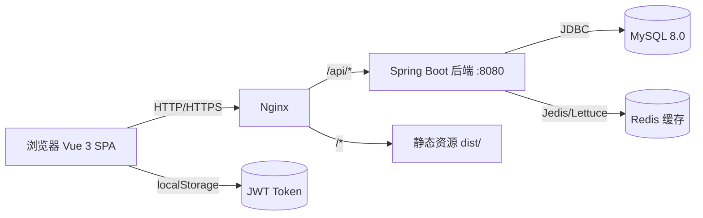
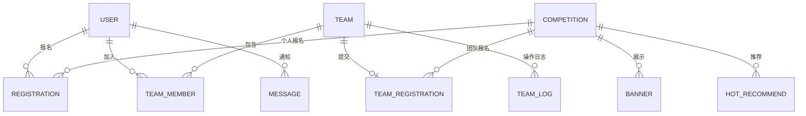

# 高校学科竞赛报名管理系统 - 技术架构文档

## 1. 架构设计

采用经典前后端分离 + Nginx 反向代理架构。



---

## 2. 技术选型

### 2.1 前端

| 技术 | 版本 | 用途 |
|------|------|------|
| Vue | 3.4.x | 主框架（Composition API） |
| Vite | 5.x | 构建工具 |
| Element Plus | 2.x | UI 组件库 |
| Pinia | 2.x | 状态管理（用户、JWT、菜单） |
| Vue Router | 4.x | 路由（守卫鉴权） |
| Axios | 1.x | HTTP 客户端（拦截器统一加 Token） |
| ECharts | 5.x | 数据统计图表 |
| SCSS | - | 样式预处理 |

### 2.2 后端（已实现）

| 技术 | 版本 | 用途 |
|------|------|------|
| Spring Boot | 2.7.18 | 主框架 |
| Spring Security | 5.7.x | 安全框架 + JWT 过滤器 |
| MyBatis-Plus | 3.5.5 | ORM |
| MySQL | 8.0 | 数据库 |
| Redis | 6.x | 缓存（首页轮播、热门推荐、竞赛列表） |
| jjwt | 0.11.5 | JWT 生成与解析 |
| BCrypt | - | 密码加密（Spring Security 内置） |
| Hutool | 5.8.x | 工具类 |
| EasyExcel | 3.x | 报名信息导出 |
| Lombok | - | 简化代码 |

### 2.3 部署

- **Nginx**：反向代理 + 静态资源托管
- **Maven**：后端打包
- **多环境**：`application-dev.yml` / `application-prod.yml`

---

## 3. 目录结构

### 3.1 后端（已存在）

```
cms-backend/
├── pom.xml
├── src/main/java/com/cms/
│   ├── CmsApplication.java
│   ├── common/      # 公共：Result、异常、常量、工具
│   ├── config/      # 配置：Security、MyBatisPlus、WebMvc
│   ├── controller/  # 控制器（按角色分包）
│   ├── dto/         # 请求 DTO
│   ├── entity/      # 实体（10 张表）
│   ├── interceptor/ # JWT 拦截器
│   ├── mapper/      # MyBatis Mapper
│   ├── service/     # 服务接口与实现
│   └── vo/          # 视图对象
└── src/main/resources/
    ├── application.yml
    ├── application-dev.yml
    └── application-prod.yml
```

### 3.2 前端（待创建）

```
cms-frontend/
├── index.html
├── package.json
├── vite.config.js
├── src/
│   ├── main.js              # 入口
│   ├── App.vue
│   ├── router/
│   │   └── index.js         # 路由 + 守卫
│   ├── stores/
│   │   ├── user.js          # Pinia 用户状态
│   │   └── app.js
│   ├── api/
│   │   ├── request.js       # Axios 实例 + 拦截器
│   │   ├── auth.js          # 登录、注册、信息
│   │   ├── competition.js   # 竞赛
│   │   ├── registration.js  # 报名
│   │   ├── team.js          # 团队
│   │   └── admin.js         # 管理员
│   ├── views/
│   │   ├── auth/            # Login.vue / Register.vue
│   │   ├── public/          # Home.vue / CompetitionList.vue / Detail.vue
│   │   ├── student/         # Profile.vue / MyRegistration.vue / MyTeam.vue
│   │   ├── teacher/         # TeacherAudit.vue / TeacherStats.vue
│   │   └── admin/           # CompetitionMgmt.vue / RegistrationMgmt.vue / Banner.vue / Stats.vue
│   ├── components/          # 通用组件（Button、Modal、StatusTag、Card）
│   ├── utils/               # 工具函数
│   ├── assets/
│   └── styles/
│       ├── variables.scss   # 颜色、间距变量
│       └── global.scss
```

---

## 4. 路由定义

| 路由 | 页面 | 权限 |
|------|------|------|
| `/login` | 登录 | 公开 |
| `/register` | 注册 | 公开 |
| `/` | 首页（轮播+热门+近期竞赛） | 公开 |
| `/competitions` | 竞赛列表 | 公开 |
| `/competitions/:id` | 竞赛详情 | 公开（操作需登录） |
| `/profile` | 个人中心 | 学生 |
| `/my-registrations` | 我的报名 | 学生 |
| `/my-teams` | 我的团队 | 学生 |
| `/teams/:id` | 团队详情 | 成员 |
| `/teacher/audit` | 报名审核 | 老师 |
| `/teacher/stats` | 我的统计 | 老师 |
| `/admin/competitions` | 竞赛管理 | 管理员 |
| `/admin/registrations` | 报名管理 | 管理员 |
| `/admin/banners` | 轮播图管理 | 管理员 |
| `/admin/hot` | 热门推荐 | 管理员 |
| `/admin/stats` | 数据大屏 | 管理员 |

---

## 5. API 定义（与后端对齐）

### 5.1 认证

| 方法 | 路径 | 请求 | 响应 |
|------|------|------|------|
| POST | `/api/auth/login` | `{username, password}` | `{token, role, userId, realName}` |
| POST | `/api/auth/register` | RegisterDTO | `Result` |
| GET  | `/api/auth/info` | - | User 完整信息 |
| POST | `/api/auth/logout` | - | `Result` |

### 5.2 公共

| 方法 | 路径 | 说明 |
|------|------|------|
| GET | `/api/public/banners/active` | 轮播图 |
| GET | `/api/public/hot/active` | 热门推荐 |
| GET | `/api/public/competitions` | 竞赛列表（分页+搜索+筛选） |
| GET | `/api/public/competitions/{id}` | 竞赛详情 |

### 5.3 学生

| 方法 | 路径 | 说明 |
|------|------|------|
| GET | `/api/student/profile` | 个人资料 |
| POST | `/api/student/registration` | 个人赛报名 |
| GET | `/api/student/registration/list` | 我的报名 |
| POST | `/api/student/team` | 创建团队 |
| POST | `/api/student/team/join` | 加入团队（邀请码） |

### 5.4 老师

| 方法 | 路径 | 说明 |
|------|------|------|
| GET | `/api/teacher/competitions` | 我指导的竞赛 |
| GET | `/api/teacher/registrations` | 待审核报名 |
| POST | `/api/teacher/registrations/{id}/approve` | 通过 |
| POST | `/api/teacher/registrations/{id}/reject` | 拒绝 |

### 5.5 管理员

| 方法 | 路径 | 说明 |
|------|------|------|
| CRUD | `/api/admin/competitions` | 竞赛管理 |
| CRUD | `/api/admin/banners` | 轮播图 |
| CRUD | `/api/admin/hot` | 热门推荐 |
| GET | `/api/admin/registrations` | 全部报名 |
| GET | `/api/admin/statistics/overview` | 统计概览 |

---

## 6. 数据模型（已存在）

### 6.1 ER 关系



### 6.2 核心表（10 张）

1. **user**：用户（id, username, password[Bcrypt], role, real_name, student_no, college, phone, email, avatar）
2. **competition**：竞赛（id, title, category, cover, description, organizer, register_start, register_end, contest_time, max_team_size, status, teacher_id）
3. **registration**：个人报名（id, user_id, competition_id, status, attachment, created_at）
4. **team**：团队（id, name, slogan, captain_id, competition_id, invite_code, status）
5. **team_member**：团队成员（id, team_id, user_id, role, join_status, joined_at）
6. **team_registration**：团队报名（id, team_id, competition_id, status, attachment, submitted_at）
7. **banner**：轮播图（id, title, image, link, sort, status, start_time, end_time）
8. **hot_recommend**：热门推荐（id, competition_id, sort, status）
9. **message**：系统消息（id, user_id, type, content, is_read）
10. **team_log**：团队日志（id, team_id, user_id, action, content, created_at）

---

## 7. 安全设计

- **JWT**：登录后生成，Header `Authorization: Bearer <token>`，过期 24h
- **BCrypt**：密码 strength=10 加密入库
- **SQL 注入**：MyBatis `#{}` 占位符
- **XSS**：前端 v-html 转义、后端 Jsoup 过滤
- **CSRF**：前后端分离禁用 CSRF，依赖 Token 鉴权
- **限流**：登录 5 次/15 分钟账号锁定（Redis 计数）
- **CORS**：后端配置允许前端域名跨域
- **接口鉴权**：`@PreAuthorize("hasRole('ADMIN')")` 注解
