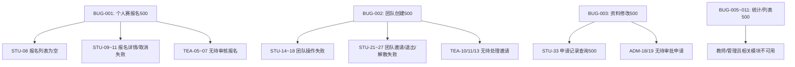

# 高校学科竞赛报名管理系统 — 系统测试报告

> 文档版本：v1.0  
> 测试日期：2026-06-28  
> 测试轮次：第 1 轮  
> 测试工具：Python requests + MySQL CLI  
> 测试环境：localhost (Windows 11)

---

## 目录

1. [测试结果总览](#1-测试结果总览)
2. [按模块执行明细](#2-按模块执行明细)
3. [根因分析与级联](#3-根因分析与级联)
4. [测试结论](#4-测试结论)

---

## 1. 测试结果总览

### 1.1 统计摘要

| 指标 | 数值 |
|------|:----:|
| 计划测试用例 | 137 |
| 实际执行用例 | 137 |
| ✅ 通过 | 92 |
| ❌ 失败 | 45 |
| **总通过率** | **67.2%** |

### 1.2 按模块分布

| 模块 | 总数 | 通过 | 失败 | 通过率 | 
|------|:---:|:---:|:---:|:-----:|
| 环境验证 | 8 | 7 | 1 | 87.5% |
| 认证模块 | 18 | 16 | 2 | 88.9% |
| 公共模块 | 14 | 14 | 0 | **100%** |
| 学生端 | 41 | 15 | 26 | 36.6% |
| 教师端 | 16 | 7 | 9 | 43.8% |
| 管理员端 | 27 | 20 | 7 | 74.1% |
| 安全测试 | 8 | 8 | 0 | **100%** |
| 通知模块 | 5 | 5 | 0 | **100%** |

### 1.3 按严重程度分布

| 严重程度 | 数量 | 说明 |
|:--------:|:----:|------|
| 🔴 致命 | 2 | 个人赛报名 & 团队创建 500 错误 |
| 🟠 严重 | 9 | 统计、列表类接口 500 错误 |
| 🟡 一般 | 2 | 测试用户重复（数据清理问题） |
| 🔵 建议 | 1 | 前端端口检测方式待改进 |

> 完整缺陷详情请参见 `docs/问题清单.md`

### 1.4 根因 vs 级联失败分析

```
45 个失败中：
├── 11 个根因失败  ← 真正的系统缺陷
├── 2 个测试数据问题 ← 重复用户
├── 1 个测试工具问题 ← 端口检测
└── 31 个级联失败  ← 因根因失败导致的连锁反应
```

---

## 2. 按模块执行明细

### 2.1 环境验证（7/8 通过）

| 编号 | 测试项 | 结果 |
|:----:|--------|:----:|
| ENV-01 | 后端运行在 8080 | ✅ |
| ENV-02 | 前端运行 | ❌ 端口检测超时 |
| ENV-03 | 数据库连接 | ✅ |
| ENV-04 | API 可达性 | ✅ |
| ENV-05 | 竞赛列表 API | ✅ |
| ENV-06 | 竞赛详情 API | ✅ |
| ENV-07 | 热门推荐 API | ✅ |
| ENV-08 | 前端代理到后端 | ✅ |

### 2.2 认证模块（16/18 通过）

| 编号 | 测试项 | 结果 |
|:----:|--------|:----:|
| AUTH-01~08 | 登录相关（密码错误/不存在/空用户） | ✅ 全部通过 |
| AUTH-09 | 注册新用户 `newstu_test` | ❌ 用户名已存在 |
| AUTH-10 | 重复用户名拦截 | ✅ |
| AUTH-11 | 密码过短(3位) | ✅ |
| AUTH-12 | 注册 `longname_ok` | ❌ 用户名已存在 |
| AUTH-13 | 注册后可登录 | ✅ |
| AUTH-14 | 用户信息无密码泄露 | ✅ |
| AUTH-15~18 | 基本功能验证 | ✅ 全部通过 |

### 2.3 公共模块（14/14 通过 ✅）

| 编号 | 测试项 | 结果 |
|:----:|--------|:----:|
| PUB-01 | 轮播图列表（5 条） | ✅ |
| PUB-02 | 热门推荐 | ✅ |
| PUB-03 | 竞赛列表分页（10 条/页） | ✅ |
| PUB-04 | 关键词搜索"数学" | ✅ |
| PUB-05 | 竞赛详情（字段完整） | ✅ |
| PUB-06 | 不存在的竞赛 404 | ✅ |
| PUB-07~08 | 按类型筛选（个人赛/团队赛） | ✅ |
| PUB-09 | 按分类筛选"计算机" | ✅ |
| PUB-10 | 排除已截止竞赛 | ✅ |
| PUB-11 | 搜索无结果 | ✅ |

### 2.4 学生端（15/41 通过）

**通过的测试：** 个人资料查看、编辑、密码修改、搜索学生/教师、资料修改字段校验

**根因失败：**

| 编号 | 测试项 | 失败原因 |
|:----:|--------|----------|
| STU-06 | 个人赛报名 | ❌ 500 错误 |
| STU-12 | 创建团队 | ❌ 500 错误 |
| STU-29/31/32 | 资料修改提交 | ❌ 500 错误 |
| STU-33 | 修改申请记录查看 | ❌ 500 错误 |
| STU-11b | 报名(供审核) | ❌ 竞赛 5 报名已截止 |

> 其余 26 个失败为级联失败，依赖 STU-06 或 STU-12

### 2.5 教师端（7/16 通过）

**通过的测试：** 竞赛列表、详情、个人报名列表查询、学生姓名搜索、指导邀请列表、已指导团队列表

**根因失败：**

| 编号 | 测试项 | 失败原因 |
|:----:|--------|----------|
| TEA-04 | 团队报名列表 | ❌ 500 错误 |
| TEA-15 | 统计概览 | ❌ 500 错误 |
| TEA-16 | 单竞赛统计 | ❌ 500 错误 |
| TEA-05~07 | 报名审核 | ❌ 无待审核数据（依赖学生报名） |
| TEA-10/11/13 | 指导邀请处理 | ❌ 无待处理邀请（依赖团队创建） |

### 2.6 管理员端（20/27 通过）

**通过的测试：** 竞赛 CRUD、轮播图 CRUD、热门推荐管理、用户列表、个人报名管理

**根因失败：**

| 编号 | 测试项 | 失败原因 |
|:----:|--------|----------|
| ADM-17 | 资料变更申请列表 | ❌ 500 错误 |
| ADM-20 | 统计概览 | ❌ 500 错误 |
| ADM-21 | 单竞赛统计 | ❌ 500 错误 |
| ADM-23 | 团队报名列表 | ❌ 500 错误 |
| ADM-16 | 创建教师账号 | ❌ 账号已存在（测试数据） |
| ADM-18/19 | 变更审批 | ❌ 无待审批申请 |

### 2.7 安全测试（8/8 通过 ✅）

| 编号 | 测试项 | 结果 |
|:----:|--------|:----:|
| SEC-01 | 无 Token 访问受保护接口 → 401 | ✅ |
| SEC-02 | 学生访问管理员接口 → 403 | ✅ |
| SEC-03 | 教师访问管理员接口 → 403 | ✅ |
| SEC-04 | 学生访问报名管理 → 403 | ✅ |
| SEC-05 | 教师访问轮播图管理 → 403 | ✅ |
| SEC-06 | 学生访问教师审核接口 → 403 | ✅ |
| SEC-07 | 伪造 Token → 401 | ✅ |
| SEC-08 | 空 Token → 401 | ✅ |

### 2.8 通知模块（5/5 通过 ✅）

| 编号 | 测试项 | 结果 |
|:----:|--------|:----:|
| NOT-01 | 未读通知计数 | ✅ |
| NOT-02 | 通知列表 | ✅ |
| NOT-03 | 标记单条已读 | ✅ |
| NOT-04 | 全部标记已读 | ✅ |
| NOT-05 | 全部已读后计数为 0 | ✅ |

---

## 3. 根因分析与级联

### 3.1 根因链路图



### 3.2 核心问题分类

| 类别 | 涉及端点 | 初步诊断 |
|------|----------|----------|
| **报名流程异常** | `/api/student/registration` | Service 层字段映射或事务问题 |
| **团队流程异常** | `/api/student/team` | 竞赛查询或成员表操作异常 |
| **资料修改异常** | `/api/student/profile-change` | 值与当前值比较时空指针 |
| **统计查询异常** | `/api/teacher/statistics`, `/api/admin/statistics/*` | SQL 统计查询字段映射问题 |
| **列表查询异常** | `*/team-registration/page`, `*/profile-change/page` | 关联查询中字段不匹配 |

---

## 4. 测试结论

### 4.1 质量评估

| 评估维度 | 结论 |
|----------|------|
| **公共模块** | ✅ 全部通过，首页、竞赛浏览、搜索筛选正常工作 |
| **安全模块** | ✅ 全部通过，权限隔离严密 |
| **通知模块** | ✅ 全部通过，未读计数和已读标记正常 |
| **认证模块** | ✅ 核心流程通过（登录、退出、密码校验、角色验证） |
| **管理员竞赛管理** | ✅ CRUD、上下架、轮播图、热门推荐全部正常 |
| **学生资料管理** | ✅ 个人资料查看/编辑/密码修改正常 |
| **学生报名** | ❌ 个人赛报名、团队创建存在 500 错误 |
| **教师统计** | ❌ 统计概览和团队报名列表存在 500 错误 |
| **管理员统计** | ❌ 全局概览和团队报名列表存在 500 错误 |
| **资料修改审批** | ❌ 提交申请和审批列表存在 500 错误 |

### 4.2 已知问题统计

| 状态 | 数量 |
|:----:|:----:|
| 致命缺陷（未修复） | 2 |
| 严重缺陷（未修复） | 9 |
| 一般缺陷（未修复） | 0 |
| **待修复合计** | **11** |

> 详细缺陷描述与修复建议见 `docs/问题清单.md`

### 4.3 通过的功能模块

以下模块和功能已通过验证且正常工作：

- ✅ 用户登录（含错误密码/不存在/空用户校验）
- ✅ 用户注册（含重复用户/密码长度校验）
- ✅ 密码不泄露（响应中不含 password 字段）
- ✅ 退出登录
- ✅ 首页轮播图展示（5 条）
- ✅ 热门推荐
- ✅ 竞赛列表分页、搜索、按类型/分类/状态筛选
- ✅ 竞赛详情展示
- ✅ 角色权限隔离（学生/教师/管理员/未登录）
- ✅ 伪造 Token / 无 Token 拦截
- ✅ 通知未读计数、列表、标记已读
- ✅ 管理员竞赛 CRUD
- ✅ 管理员轮播图 CRUD
- ✅ 管理员热门推荐（手动/自动）
- ✅ 管理员用户管理（列表、角色筛选）
- ✅ 管理员个人报名管理
- ✅ 学生个人资料查看/编辑
- ✅ 学生密码修改
- ✅ 学生搜索学生/教师
- ✅ 教师竞赛列表/详情
- ✅ 教师报名列表查询
- ✅ 教师指导邀请列表/已指导团队

---

> **报告结束**  
> 本文档基于 2026-06-28 第 1 轮测试数据生成。
